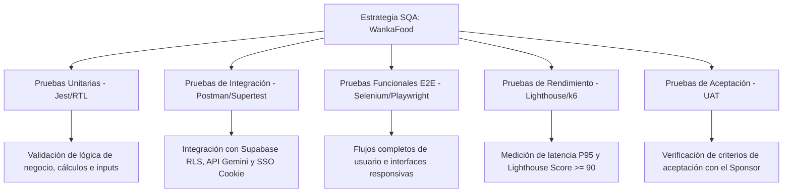
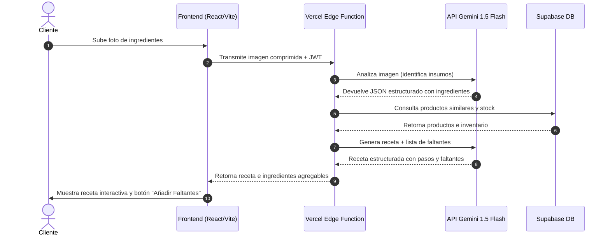

# Plan de Pruebas y Casos de Prueba del Sistema WankaFood
## E-commerce y Módulo de Administración

Este documento técnico de análisis y diseño de pruebas describe los **Escenarios de Prueba**, el **Set de Datos de Prueba** y los **Casos de Prueba** para la plataforma **WankaFood (Cocina Inteligente)**. Está estructurado para que el equipo de Aseguramiento de la Calidad de Software (SQA) pueda ejecutar la validación técnica mediante herramientas automáticas (como Selenium, Jest, Postman, Lighthouse, k6) y validaciones manuales (UAT).

---

## 1. Alcance y Estrategia de Pruebas SQA

Para validar la confiabilidad y calidad del sistema WankaFood según la norma **ISO/IEC 25010**, se define una estrategia basada en 5 niveles de pruebas de software:



### 1.1. Pruebas Unitarias (Unit Testing)
*   **Enfoque**: Evaluar funciones lógicas aisladas, validaciones de formularios y cálculos numéricos sin interactuar con la base de datos o APIs externas.
*   **Herramientas**: Jest y React Testing Library.
*   **Componentes Clave**: Lógica de cálculo del carrito (totales, IGV), validaciones de contraseña segura y parseadores de respuestas JSON de Gemini.

### 1.2. Pruebas de Integración (Integration Testing)
*   **Enfoque**: Validar la comunicación entre diferentes módulos de software, endpoints API, el servicio SSO y dependencias de infraestructura en la nube.
*   **Herramientas**: Postman, Supertest o la suite integrada de Next.js API testing.
*   **Componentes Clave**: Integración del cliente con Supabase Auth/DB, políticas de seguridad RLS, API de Google Gemini (Genkit) y compartición de la cookie de sesión `wankas_sid` entre e-commerce (`wankafood.vercel.app`) y administrador (`admin-wankas.vercel.app`).

### 1.3. Pruebas Funcionales End-to-End (E2E Testing)
*   **Enfoque**: Validar que los flujos de negocio completos funcionen correctamente a través de la interfaz de usuario, simulando las acciones exactas de un cliente o administrador.
*   **Herramientas**: **Selenium WebDriver** (Node.js/Python), Cypress o Playwright.
*   **Componentes Clave**: Flujo de compra completo, flujo de identificación visual de ingredientes, flujo de actualización de pedidos en el Panel Administrativo.

### 1.4. Pruebas de Rendimiento (Performance Testing)
*   **Enfoque**: Verificar la velocidad de respuesta del sistema bajo carga y el cumplimiento de las restricciones de tiempo (P95 < 1.5s para transacciones estándar).
*   **Herramientas**: Lighthouse (para rendimiento del lado del cliente) y k6 o Artillery (para pruebas de estrés concurrente en APIs).
*   **Componentes Clave**: Carga del Catálogo con alto tráfico, procesamiento de checkout y tiempo de respuesta en la Edge Function al invocar Gemini.

### 1.5. Pruebas de Aceptación (User Acceptance Testing - UAT)
*   **Enfoque**: Validar que el software cumpla con las necesidades reales de los usuarios urbanos de Lima y los objetivos del minimarket familiar (incrementar ventas, optimizar personal).
*   **Herramientas**: Guías de validación de usuario (UAT checklists) y encuestas de usabilidad SUS (System Usability Scale).
*   **Componentes Clave**: Flujo completo de la "Cocina Inteligente", legibilidad de recetas y facilidad del proceso de recojo en tienda física.

---

## 2. Set de Datos de Prueba (Test Dataset)

Para garantizar la reproducibilidad de las pruebas, se define el siguiente conjunto de datos maestros estructurado. Estos datos representan el estado inicial de la base de datos de Supabase para las pruebas.

### 2.1. Perfiles de Usuario (`profiles`)
Representan las credenciales y roles necesarios para probar la seguridad, SSO y RLS.

> [!NOTE]
> * El **Administrador** (`admin.wankas@gmail.com` / `admin123`) ya existe en la base de datos de Supabase.
> * El **Worker (Empleado)** (`worker.wankas@gmail.com` / `worker123`) tiene un correo asignado, pero está configurado con `email_confirmed_at = now()` en la base de datos, por lo que **no requiere confirmación por correo electrónico** para iniciar sesión.
> * Los **Customers (Clientes)** son creados dinámicamente por ellos mismos registrándose a través de la aplicación de E-commerce.

| id (UUID) | name | email | phone_number | role | password (Texto Plano / Hasheado) |
| :--- | :--- | :--- | :--- | :--- | :--- |
| (Se auto-crea en test) | Juan Pérez (Cliente) | `nuevo_cliente@gmail.com` | `999888777` | `customer` | `WankaPass2026!` / Hasheado por app |
| `d1102586-a118-44d4-9864-e684b6d5911a` | Administrador | `admin.wankas@gmail.com` | `123-456-7890` | `admin` | `admin123` / Hasheado con bcrypt |
| `8a29e5a3-e6a3-41b6-a4d3-6c5ff0b13aa7` | Carlos Gomez (Trabajador)| `worker.wankas@gmail.com` | `987-654-3210` | `worker` | `worker123` / Hasheado con bcrypt |

*(Para recrear o actualizar estos perfiles en la base de datos de Supabase, puedes ejecutar el script [crear_usuarios_prueba.sql](file:///c:/Users/marec/Desktop/Proyecto-Wankas/crear_usuarios_prueba.sql) provisto en la raíz del proyecto).*

### 2.2. Categorías (`categories`)

| id (UUID) | name_es | name_en | description_es |
| :--- | :--- | :--- | :--- |
| `c111581c-99d7-4638-b0a6-12185b3bc111` | Abarrotes | Groceries | Aceites, arroz, fideos, conservas y salsas |
| `c222581c-99d7-4638-b0a6-12185b3bc222` | Lácteos | Dairy | Leches, quesos, yogur y derivados lácteos |
| `c333581c-99d7-4638-b0a6-12185b3bc333` | Verduras | Vegetables | Verduras frescas, legumbres y hortalizas |

### 2.3. Ubicaciones / Sedes de Recojo (`locations`)

| id (UUID) | name_es | address | opening_hours_es | latitude | longitude |
| :--- | :--- | :--- | :--- | :--- | :--- |
| `l111581c-99d7-4638-b0a6-12185b3bc111` | Sede Central - Huancayo | Av. Giráldez 456, Huancayo | `{"semana": "08:00 - 21:00", "sabado": "09:00 - 18:00"}` | `-12.0674` | `-75.2099` |
| `l222581c-99d7-4638-b0a6-12185b3bc222` | Sede El Tambo | Av. Julio C. Tello 123, El Tambo | `{"semana": "08:00 - 20:00"}` | `-12.0552` | `-75.2155` |

### 2.4. Productos (`products`)

| id (UUID) | category_id (FK) | name_es | price | stock | image_urls | thumbnail_url |
| :--- | :--- | :--- | :--- | :--- | :--- | :--- |
| `p111581c-99d7-4638-b0a6-12185b3bc111` | `c111581c...` (Abarrotes) | Arroz Costeño 1kg | 4.50 | 12 | `["/img/arroz.jpg"]` | `/img/arroz_thumb.jpg` |
| `p222581c...` (Abarrotes) | `c111581c...` (Abarrotes) | Fideos Don Vittorio 500g | 3.20 | 3 | `["/img/fideos.jpg"]` | `/img/fideos_thumb.jpg` |
| `p333581c...` (Lácteos) | `c222581c...` (Lácteos) | Leche Gloria Azul 400g | 4.20 | 15 | `["/img/leche.jpg"]` | `/img/leche_thumb.jpg` |
| `p444581c...` (Verduras) | `c333581c...` (Verduras) | Cebolla Roja 1kg | 2.50 | 10 | `["/img/cebolla.jpg"]` | `/img/cebolla_thumb.jpg` |

### 2.5. Dataset para Pruebas de IA (Imágenes de Insumos)
*   **Caso Exitoso (Imagen 1 - `receta_tallarines_rojos.jpg`)**: Foto real de ingredientes sobre una mesa que contiene: 1 cebolla, 1 ajo, 1 paquete de fideos, y salsa de tomate.
*   **Caso Exótico (Imagen 2 - `imagen_no_comestible.png`)**: Foto de un teclado de computadora y un cuaderno de apuntes.
*   **Caso de Error (Imagen 3 - `corrupt_file.png`)**: Archivo de texto vacío de 0 bytes renombrado con extensión `.png`.

---

## 3. Escenarios y Casos de Prueba del Sistema

---

### Escenario 1: Proceso Completo de Autenticación, Navegación y Compra (E-Commerce)
*   **Descripción**: Este escenario cubre el flujo estándar de un cliente final desde el registro de su cuenta, la búsqueda e incorporación de artículos en el carrito, la selección de punto de retiro y el envío del pedido que genera una boleta con código QR.

#### Caso de Prueba CP-1.1: Registro de Cliente Exitoso e Inicio de Sesión
*   **ID Requisito**: RNF-03, RF-01 (Profiles)
*   **Tipo de Prueba**: Funcional (E2E) | **Herramienta**: Selenium / Playwright
*   **Precondiciones**:
    1.  La base de datos de Supabase está activa.
    2.  El correo electrónico `nuevo_cliente@gmail.com` no se encuentra registrado en la tabla `profiles`.
*   **Datos de Entrada**:
    *   Formulario de Registro: Nombre = "Juan Pérez", Correo = `nuevo_cliente@gmail.com`, Teléfono = "999888777", Contraseña = "WankaPass2026!", Confirmar Contraseña = "WankaPass2026!"
*   **Pasos a Ejecutar**:
    1.  Navegar a la página de registro del e-commerce: `https://wankafood.vercel.app/register`.
    2.  Completar los campos con los datos de entrada especificados.
    3.  Hacer clic en el botón "Registrarse".
    4.  Tras ser redirigido, ingresar las credenciales creadas en la página de inicio de sesión: `https://wankafood.vercel.app/login`.
    5.  Hacer clic en "Iniciar Sesión".
*   **Resultado Esperado**:
    *   El registro es exitoso y el perfil se guarda en la tabla `profiles` con el rol `customer` por defecto.
    *   El inicio de sesión se realiza sin errores, redirigiendo a la pantalla de catálogo (`https://wankafood.vercel.app/`) y mostrando el nombre "Juan Pérez" en la cabecera.
*   **Postcondiciones**: La cookie `wankas_sid` se genera en el navegador almacenando la sesión activa del usuario.

#### Caso de Prueba CP-1.2: Compra en Línea con Selección de Sede y Recojo
*   **ID Requisito**: RF-01, RF-02, RF-03.1, RF-03.2, RF-04, RF-06
*   **Tipo de Prueba**: Funcional (E2E) | **Herramienta**: Selenium / Playwright
*   **Precondiciones**:
    1.  El usuario se auto-registra o utiliza la cuenta `nuevo_cliente@gmail.com` creada previamente.
    2.  El stock de "Arroz Costeño 1kg" es de 12 unidades y de "Fideos Don Vittorio 500g" es de 3 unidades.
*   **Datos de Entrada**:
    *   Término de búsqueda: "Arroz"
    *   Productos a comprar: 2 unidades de "Arroz Costeño 1kg", 1 unidad de "Fideos Don Vittorio 500g"
    *   Sede de Recojo: "Sede Central - Huancayo"
    *   Fecha de Recojo: Mañana a las 14:00 horas.
    *   Notas adicionales: "Por favor, empaquetar en bolsas separadas."
*   **Pasos a Ejecutar**:
    1.  Navegar al catálogo: `https://wankafood.vercel.app/`.
    2.  Digitar "Arroz" en el input de búsqueda. Verificar que solo aparezcan productos coincidentes.
    3.  Seleccionar "Arroz Costeño 1kg" e incrementar la cantidad a 2. Hacer clic en "Añadir al carrito".
    4.  Limpiar el filtro y buscar "Fideos". Añadir 1 unidad de "Fideos Don Vittorio 500g" al carrito.
    5.  Ir a la vista del carrito de compras: `https://wankafood.vercel.app/cart`.
    6.  Verificar que el desglose de precios sea correcto: Total = (2 * S/. 4.50) + (1 * S/. 3.20) = S/. 12.20.
    7.  Completar el formulario de envío seleccionando "Sede Central - Huancayo", fecha y hora de recojo para mañana, y añadir la nota correspondiente.
    8.  Hacer clic en "Confirmar Pedido".
*   **Resultado Esperado**:
    *   El sistema registra el pedido en la tabla `orders` en estado `pending` y los ítems correspondientes en la tabla `order_items`.
    *   El sistema despliega una pantalla de confirmación exitosa con los datos del pedido y una boleta digital con un código QR para el pago en caja.
*   **Postcondiciones**: El stock temporal de los productos en la base de datos se mantiene estable hasta la validación de pago.

#### Caso de Prueba CP-1.3: Cancelación de Pedido Pendiente
*   **ID Requisito**: RF-07
*   **Tipo de Prueba**: Integración / Funcional | **Herramienta**: Jest / Selenium
*   **Precondiciones**:
    1.  El usuario `nuevo_cliente@gmail.com` tiene un pedido en estado `pending`.
*   **Datos de Entrada**: ID del pedido recién creado.
*   **Pasos a Ejecutar**:
    1.  Navegar a la sección "Mis Pedidos": `https://wankafood.vercel.app/my-orders`.
    2.  Ubicar el pedido activo y hacer clic en el botón "Cancelar Pedido".
    3.  Confirmar la acción en el cuadro de diálogo modal.
*   **Resultado Esperado**:
    *   El sistema envía una petición de actualización a Supabase.
    *   El estado del pedido se actualiza a `cancelled` en la tabla `orders`.
    *   El botón "Cancelar Pedido" desaparece de la interfaz para ese pedido en particular.
*   **Postcondiciones**: El registro queda en base de datos con estado `cancelled`.

---

### Escenario 2: Asistente de Cocina Inteligente con IA (Google Gemini 1.5 Flash)
*   **Descripción**: Valida el comportamiento del core inteligente del sistema, el cual debe reconocer ingredientes por visión computacional, buscar ingredientes faltantes en el catálogo y sugerir recetas peruanas interactivas.



#### Caso de Prueba CP-2.1: Reconocimiento Exitoso de Ingredientes vía Imagen
*   **ID Requisito**: RF-08, RF-09
*   **Tipo de Prueba**: Integración (API) | **Herramienta**: Postman / Jest
*   **Precondiciones**:
    1.  El usuario se encuentra en la sección de "Cocina Inteligente" del e-commerce.
    2.  La API de Google AI Studio (Gemini) está operativa y su key está correctamente configurada en el `.env`.
*   **Datos de Entrada**: Archivo de imagen real `receta_tallarines_rojos.jpg` (cebolla, fideos, ajo).
*   **Pasos a Ejecutar**:
    1.  Hacer clic en el botón de cámara o arrastrar el archivo `receta_tallarines_rojos.jpg` al área de carga de imágenes.
    2.  Esperar a que se procese la imagen.
*   **Resultado Esperado**:
    *   El backend envía de manera segura (HTTPS TLS 1.3) el payload de la imagen a la Edge Function de Vercel.
    *   El modelo Gemini 1.5 Flash extrae la información en un formato JSON estricto.
    *   La interfaz del e-commerce muestra la lista de ingredientes reconocidos: `["Cebolla", "Ajo", "Fideos"]`.
*   **Postcondiciones**: El estado del asistente en el cliente almacena la lista de ingredientes temporales.

#### Caso de Prueba CP-2.2: Generación de Recetas y Compra de Ingredientes Faltantes
*   **ID Requisito**: RF-10, RF-11, RF-14
*   **Tipo de Prueba**: Integración / Funcional E2E | **Herramienta**: Selenium / Jest
*   **Precondiciones**:
    1.  El sistema ha identificado previamente los ingredientes: `["Cebolla", "Ajo", "Fideos"]`.
    2.  En la base de datos se cuenta con stock de "Salsa de Tomate" (ingrediente necesario para la receta de tallarines rojos, pero que el cliente no tiene en su foto).
*   **Datos de Entrada**: Ingredientes reconocidos.
*   **Pasos a Ejecutar**:
    1.  Hacer clic en el botón "Sugerir Receta".
    2.  Verificar que la receta sugerida sea "Tallarines Rojos con Cebolla y Ajo" y que contenga los pasos en español.
    3.  Verificar que el sistema detecte "Salsa de Tomate" como ingrediente faltante e indique su precio y stock.
    4.  Hacer clic en el botón "Añadir Ingredientes Faltantes al Carrito".
    5.  Navegar a la pantalla del carrito de compras.
*   **Resultado Esperado**:
    *   El sistema genera e ilustra la receta estructurada.
    *   Se añade automáticamente 1 unidad de "Salsa de Tomate" al carrito de compras, reflejando el incremento del precio final de forma exacta.
*   **Postcondiciones**: El carrito contiene los insumos listos para el checkout.

#### Caso de Prueba CP-2.3: Degradación Elegante ante Falla del Servicio de IA
*   **ID Requisito**: RNF-01, Plan de Calidad - Estrategias de Resiliencia
*   **Tipo de Prueba**: Integración (Resiliencia) | **Herramienta**: Jest / Postman / Charles Proxy (simulación de desconexión)
*   **Precondiciones**:
    1.  Se bloquea temporalmente el acceso a la API de Google Gemini (simulando un corte del servicio o cuota agotada) o la API retorna un error 500.
*   **Datos de Entrada**: Carga de cualquier imagen de ingredientes.
*   **Pasos a Ejecutar**:
    1.  Intentar cargar la imagen de prueba `receta_tallarines_rojos.jpg`.
    2.  Observar el comportamiento de la interfaz al expirar el tiempo de respuesta.
*   **Resultado Esperado**:
    *   El sistema detecta el timeout o error de la API en menos de 5 segundos.
    *   En lugar de bloquear la aplicación con una pantalla en blanco, la interfaz muestra el mensaje de error controlado: *"No pudimos conectarnos con el asistente de IA en este momento"*.
    *   El sistema habilita inmediatamente el botón de **"Ingreso Manual de Ingredientes"** para que el usuario pueda digitar sus ingredientes y continuar su flujo.
*   **Postcondiciones**: La aplicación mantiene su operatividad en modo manual (degradación elegante).

---

### Escenario 3: Panel Administrativo - Gestión de Inventario y Pedidos
*   **Descripción**: Verifica las funcionalidades críticas para el administrador y los trabajadores del minimarket, incluyendo el control y visualización de stock y la actualización en tiempo real de los pedidos entrantes.

#### Caso de Prueba CP-3.1: Edición de Catálogo de Productos y Sincronización Inmediata
*   **ID Requisito**: RF-20, RNF-09
*   **Tipo de Prueba**: Funcional de Integración | **Herramienta**: Selenium
*   **Precondiciones**:
    1.  El administrador ha iniciado sesión en `https://admin-wankas.vercel.app/` con su cuenta (`admin.wankas@gmail.com` / `admin123`).
    2.  El producto "Arroz Costeño 1kg" tiene stock inicial = 12 y precio = S/. 4.50.
*   **Datos de Entrada**:
    *   Nuevo Precio = S/. 4.90
    *   Nuevo Stock = 20
*   **Pasos a Ejecutar**:
    1.  En el panel administrativo, navegar a la sección de "Catálogo de Productos".
    2.  Buscar "Arroz Costeño 1kg" y hacer clic en el botón de edición.
    3.  Modificar el precio a `4.90` y el stock a `20`.
    4.  Hacer clic en "Guardar Cambios".
    5.  En otra pestaña del navegador, acceder al e-commerce público `https://wankafood.vercel.app/` como cliente anónimo y buscar "Arroz Costeño 1kg".
*   **Resultado Esperado**:
    *   Los cambios se guardan en la tabla `products` de Supabase.
    *   Se escribe un registro de auditoría en la tabla `auditoria` indicando el cambio.
    *   El catálogo público del e-commerce muestra el nuevo precio de S/. 4.90 y el stock disponible actualizado a 20 de forma inmediata (desfase menor a 5 segundos).
*   **Postcondiciones**: El producto refleja los nuevos valores en la base de datos de producción.

#### Caso de Prueba CP-3.2: Actualización de Estado de Pedido y Descuento de Stock Físico
*   **ID Requisito**: RF-17, RF-19
*   **Tipo de Prueba**: Integración / Transaccional | **Herramienta**: Selenium / Jest
*   **Precondiciones**:
    1.  Se ha creado un pedido con ID `test-order-uuid` que contiene 2 unidades del producto "Arroz Costeño 1kg" (stock actual = 20).
    2.  El pedido se encuentra en estado `pending`.
    3.  El trabajador de la tienda inicia sesión en el administrador `https://admin-wankas.vercel.app/` usando la cuenta pre-confirmada (`worker.wankas@gmail.com` / `worker123`).
*   **Datos de Entrada**: ID de pedido y acción "Completar pedido".
*   **Pasos a Ejecutar**:
    1.  Navegar a la pestaña "Pedidos Recientes" en el Panel de Administración.
    2.  Seleccionar el pedido `test-order-uuid` y hacer clic en la acción de cambio de estado.
    3.  Seleccionar el estado **"Completado"**.
    4.  Hacer clic en "Confirmar".
    5.  Revisar el stock actual de "Arroz Costeño 1kg".
*   **Resultado Esperado**:
    *   El estado del pedido se encuentra como `completed` en la tabla `orders`.
    *   El stock del producto "Arroz Costeño 1kg" disminuye a 18 unidades (`20 - 2`).
    *   Se registra en la tabla `auditoria` la operación ejecutada por el perfil del worker.
*   **Postcondiciones**: El pedido queda archivado en estado completado e inventario físico rebajado.

---

### Escenario 4: Seguridad, RLS y Single Sign-On (SSO)
*   **Descripción**: Asegura que el mecanismo de autenticación compartida (SSO) funcione sin fricciones y que los usuarios sin privilegios administrativos no puedan acceder a rutas sensibles del panel administrativo.

```mermaid
flowchart TD
    A[Inicio: Cliente en E-Commerce https://wankafood.vercel.app] --> B{¿Inicia sesión como Admin?}
    B -- Sí (admin.wankas@gmail.com) --> C[Establece cookie wankas_sid]
    C --> D[Navega a https://admin-wankas.vercel.app]
    D --> E[El Admin Dashboard lee la cookie]
    E --> F[Valida rol admin en Supabase]
    F --> G[Acceso Concedido de forma directa (SSO)]
    
    B -- No (nuevo_cliente@gmail.com) --> H[Establece cookie wankas_sid]
    H --> I[Intenta navegar a https://admin-wankas.vercel.app]
    I --> J[El Admin Dashboard lee la cookie]
    J --> K[Valida rol customer en Supabase]
    K --> L[Acceso Denegado: Redirección con error]
```

#### Caso de Prueba CP-4.1: Acceso SSO Exitoso de Administrador entre Aplicaciones
*   **ID Requisito**: RNF-04, RNF-03 (SSO Mechanism)
*   **Tipo de Prueba**: Integración / Seguridad | **Herramienta**: Selenium
*   **Precondiciones**:
    1.  Ambos servidores están levantados en producción (`https://wankafood.vercel.app` y `https://admin-wankas.vercel.app`).
    2.  El usuario `admin.wankas@gmail.com` tiene asignado el rol de `admin` en la tabla `profiles`.
*   **Datos de Entrada**: Credenciales del administrador (`admin.wankas@gmail.com` / `admin123`).
*   **Pasos a Ejecutar**:
    1.  Navegar a la tienda e-commerce: `https://wankafood.vercel.app/login`.
    2.  Iniciar sesión con el correo `admin.wankas@gmail.com` y su respectiva contraseña.
    3.  Verificar que la sesión se inicie correctamente.
    4.  En la misma pestaña o en una nueva ventana del navegador, digitar e ingresar a la dirección del Panel de Administración: `https://admin-wankas.vercel.app`.
*   **Resultado Esperado**:
    *   El navegador comparte la cookie `wankas_sid`.
    *   El Panel de Administración detecta el ID de sesión del SSO, consulta el almacenamiento (Redis o fallback local `.session-store.json` sincronizado) y autoriza el acceso automáticamente.
    *   El administrador accede directamente al dashboard sin necesidad de ingresar credenciales de nuevo.
*   **Postcondiciones**: Sesión de SSO unificada y válida en ambas aplicaciones.

#### Caso de Prueba CP-4.2: Restricción de Acceso a Administrador para Rol Cliente
*   **ID Requisito**: RNF-03, RNF-05 (OWASP A01: Broken Access Control)
*   **Tipo de Prueba**: Seguridad / Funcional | **Herramienta**: Selenium / Postman
*   **Precondiciones**:
    1.  El usuario ha creado una cuenta e inicia sesión en el e-commerce como `nuevo_cliente@gmail.com` (rol `customer` en profiles).
*   **Datos de Entrada**: Sesión activa con rol de cliente.
*   **Pasos a Ejecutar**:
    1.  Intentar navegar directamente a la URL del panel administrativo: `https://admin-wankas.vercel.app`.
*   **Resultado Esperado**:
    *   La aplicación del panel administrativo detecta que la sesión activa posee el rol `customer`.
    *   El acceso es bloqueado inmediatamente.
    *   El sistema redirige al usuario a la página de login del panel administrativo con un mensaje de advertencia o error 403 (Acceso Denegado).
*   **Postcondiciones**: El panel administrativo sigue protegido y no se exponen datos de negocio.

#### Caso de Prueba CP-4.3: Validación de Row Level Security (RLS) en Supabase
*   **ID Requisito**: RNF-05 (Seguridad OWASP - Supabase RLS)
*   **Tipo de Prueba**: Seguridad (Prueba de Penetración) | **Herramienta**: Postman / Supabase Client Script
*   **Precondiciones**:
    1.  El usuario ha iniciado sesión como `nuevo_cliente@gmail.com`.
*   **Datos de Entrada**: Solicitud SQL o API simulada para consultar el perfil `f745a32b-3652-47ef-8c90-953b0bc8527a` (administrador) o actualizar un pedido que pertenece a otro usuario.
*   **Pasos a Ejecutar**:
    1.  Utilizando un token JWT del cliente común, enviar una petición REST directa a la base de datos de Supabase para modificar el total de un pedido ajeno.
*   **Resultado Esperado**:
    *   El motor de base de datos de Supabase ejecuta las políticas RLS activas en la tabla `orders` y `profiles`.
    *   La base de datos genera un error (401 Unauthorized o 403 Forbidden).
    *   Ningún dato sensible es modificado o expuesto.
*   **Postcondiciones**: Las políticas de seguridad a nivel de base de datos protegen la información independientemente del cliente.

---

### Escenario 5: Rendimiento y Pruebas No Funcionales
*   **Descripción**: Verifica que la aplicación cumpla con los estándares de respuesta ágil en la carga y el cumplimiento de las normativas vigentes sobre accesibilidad y protección de datos.

#### Caso de Prueba CP-5.1: Tiempo de Respuesta de Checkout Bajo Concurrencia Moderada
*   **ID Requisito**: RNF-01, RNF-02
*   **Tipo de Prueba**: Rendimiento (Carga) | **Herramienta**: k6 / Artillery
*   **Precondiciones**:
    1.  El backend y la base de datos están en funcionamiento óptimo.
*   **Datos de Entrada**:
    *   Script de carga en k6 simulando 20 usuarios virtuales concurrentes realizando la acción de checkout durante 1 minuto.
*   **Pasos a Ejecutar**:
    1.  Ejecutar el script de pruebas en la terminal de k6.
    2.  Analizar el reporte de métricas generado al finalizar el test.
*   **Resultado Esperado**:
    *   El tiempo de respuesta promedio para el procesamiento de pedidos (checkout) debe ser menor a **1.5 segundos (P95 < 1.5s)**.
    *   La tasa de errores HTTP durante la prueba debe ser de 0%.
*   **Postcondiciones**: El sistema se mantiene estable sin degradar el rendimiento o causar bloqueos.

#### Caso de Prueba CP-5.2: Accesibilidad Web y Navegación con Teclado
*   **ID Requisito**: RNF-10 (WCAG 2.1 Nivel AA)
*   **Tipo de Prueba**: Usabilidad / Accesibilidad | **Herramienta**: Lighthouse / NVDA (Lector de pantalla)
*   **Precondiciones**:
    1.  La página de catálogo del e-commerce está cargada en el navegador.
*   **Datos de Entrada**: Controles del teclado (Tabulador, Shift+Tab, Enter).
*   **Pasos a Ejecutar**:
    1.  Desconectar el mouse del equipo.
    2.  Presionar repetidamente la tecla `Tab` para recorrer todos los elementos interactivos del catálogo (barra de búsqueda, filtros de categorías, botones de productos).
    3.  Verificar visualmente que el foco del teclado esté claramente demarcado (borde azul o contraste alto).
    4.  Ejecutar la herramienta de auditoría Lighthouse en la pestaña de Accesibilidad.
*   **Resultado Esperado**:
    *   Es posible acceder y activar cada botón o campo utilizando únicamente el teclado.
    *   El puntaje de Accesibilidad en Lighthouse de Google Chrome es **superior a 90/100**.
*   **Postcondiciones**: Cumplimiento normativo WCAG 2.1 AA asegurado.

---

## 4. Guía Técnica para Automatización de Pruebas (SQA)

El grupo SQA puede automatizar la ejecución de estos escenarios utilizando **Selenium WebDriver** en JavaScript (Node.js) para simular el comportamiento interactivo real de los usuarios en los navegadores Chrome, Firefox o Edge.

### 4.1. Configuración del Entorno de Pruebas Automáticas

Para ejecutar los scripts de automatización descritos a continuación, el equipo de control de calidad debe configurar los siguientes paquetes en una carpeta separada de pruebas o en el proyecto de test:

```bash
# Inicializar proyecto e instalar dependencias de automatización
npm init -y
npm install selenium-webdriver mocha chai dotenv --save-dev
```

### 4.2. Script de Selenium: Automatización de Flujo de Compra (CP-1.2)
El siguiente código escrito en JavaScript automatiza la búsqueda de un producto, su adición al carrito y el checkout seleccionando una sede física.

```javascript
const { Builder, By, Key, until } = require('selenium-webdriver');
const { expect } = require('chai');
require('dotenv').config();

describe('Pruebas Automatizadas de E-Commerce WankaFood - Flujo de Compra', function() {
    let driver;
    this.timeout(30000); // 30 segundos de timeout por prueba

    before(async function() {
        // Inicializar el navegador Chrome
        driver = await new Builder().forBrowser('chrome').build();
        await driver.manage().window().maximize();
    });

    after(async function() {
        // Cerrar el navegador al finalizar todas las pruebas
        await driver.quit();
    });

    it('Debería iniciar sesión y completar el checkout con éxito', async function() {
        // 1. Navegar e Iniciar Sesión con el usuario registrado
        await driver.get('https://wankafood.vercel.app/login');
        
        await driver.findElement(By.id('email')).sendKeys('nuevo_cliente@gmail.com');
        await driver.findElement(By.id('password')).sendKeys('WankaPass2026!', Key.RETURN);
        
        // Esperar a ser redirigido al catálogo
        await driver.wait(until.urlIs('https://wankafood.vercel.app/'), 10000);
        
        // 2. Buscar Producto en Catálogo
        const searchInput = await driver.findElement(By.id('search-input'));
        await searchInput.sendKeys('Arroz', Key.RETURN);
        
        // Esperar a que los elementos del catálogo se carguen y filtrar
        await driver.wait(until.elementLocated(By.className('product-card')), 5000);
        
        // 3. Añadir Producto al Carrito
        const productCard = await driver.findElement(By.xpath("//h3[contains(text(), 'Arroz Costeño')]"));
        expect(await productCard.isDisplayed()).to.be.true;
        
        // Incrementar cantidad y hacer click en añadir
        const addBtn = await driver.findElement(By.css('.btn-add-cart'));
        await addBtn.click();
        
        // Esperar y verificar alerta o cambio de estado del carrito
        await driver.wait(until.elementLocated(By.id('cart-badge')), 3000);
        
        // 4. Ir al Carrito y Proceder
        await driver.get('https://wankafood.vercel.app/cart');
        
        // Seleccionar Sede de Recojo (Dropdown)
        const locationDropdown = await driver.findElement(By.id('pickup-location'));
        await locationDropdown.click();
        await driver.findElement(By.xpath("//option[contains(text(), 'Sede Central')]")).click();
        
        // Ingresar Fecha y Hora de Recojo
        await driver.findElement(By.id('pickup-date')).sendKeys('2026-06-15T14:00');
        
        // Notas del cliente
        await driver.findElement(By.id('order-notes')).sendKeys('Automatizado por SQA');
        
        // 5. Confirmar Pedido
        const submitBtn = await driver.findElement(By.id('btn-confirm-order'));
        await submitBtn.click();
        
        // 6. Verificar generación de QR y boleta
        await driver.wait(until.urlContains('/order-confirmation'), 10000);
        const qrCodeElement = await driver.findElement(By.css('canvas, img.qr-code'));
        expect(await qrCodeElement.isDisplayed()).to.be.true;
        
        const successMessage = await driver.findElement(By.id('success-message')).getText();
        expect(successMessage).to.include('¡Pedido realizado con éxito!');
    });
});
```

### 4.3. Script de Selenium: Automatización de Seguridad SSO (CP-4.2)
Este script valida que un cliente con rol común no pueda acceder directamente a los paneles administrativos de Vercel.

```javascript
const { Builder, By, until } = require('selenium-webdriver');
const { expect } = require('chai');

describe('Pruebas de Seguridad SQA - Control de Acceso SSO', function() {
    let driver;
    this.timeout(20000);

    before(async function() {
        driver = await new Builder().forBrowser('chrome').build();
    });

    after(async function() {
        await driver.quit();
    });

    it('Debería denegar acceso al panel administrativo a un usuario con rol cliente', async function() {
        // 1. Iniciar sesión como Cliente en producción
        await driver.get('https://wankafood.vercel.app/login');
        await driver.findElement(By.id('email')).sendKeys('nuevo_cliente@gmail.com');
        await driver.findElement(By.id('password')).sendKeys('WankaPass2026!', Key.RETURN);
        await driver.wait(until.urlIs('https://wankafood.vercel.app/'), 5000);

        // 2. Intentar burlar seguridad navegando al Administrador en producción
        await driver.get('https://admin-wankas.vercel.app/');

        // 3. El sistema debe redireccionar al login administrativo o denegar el acceso
        await driver.wait(until.urlContains('https://admin-wankas.vercel.app/login'), 5000);
        
        const errorMessage = await driver.findElement(By.className('error-alert')).getText();
        expect(errorMessage).to.include('No tiene permisos para acceder a este panel');
    });
});
```

---

## 5. Recomendaciones para Validación en el Entorno SQA

1.  **Pruebas con Modelos No Deterministas (IA)**:
    Dado que las respuestas de la IA (Gemini) pueden variar en su redacción semántica, se aconseja que el equipo SQA implemente **pruebas de contrato**. El script debe validar la *estructura del esquema JSON devuelto* (claves obligatorias como `receta`, `ingredientes_faltantes`, `pasos`) en lugar de buscar coincidencias exactas de texto.
2.  **Validación de Fallback Local en Ausencia de Redis**:
    Dado que el mecanismo de SSO funciona con un fallback local (`.session-store.json`) en caso no se cuente con un servidor de Redis activo, el equipo SQA debe probar ambos escenarios:
    *   *Escenario A*: Con el servidor Redis activo en el puerto 6379.
    *   *Escenario B*: Deteniendo el contenedor de Redis para validar que el archivo JSON en la raíz del proyecto asuma la persistencia de las cookies de sesión compartidas sin interrumpir el flujo.
3.  **Monitoreo de Políticas RLS**:
    Previo a la entrega del proyecto, el equipo de SQA debe ejecutar la consulta de verificación en Supabase para asegurar que ninguna tabla sensible (`orders`, `profiles`) se encuentre abierta para lectura y escritura de usuarios no autenticados:
    ```sql
    select tablename, rowsecurity from pg_tables where schemaname = 'public';
    ```
    *(Todas las tablas de transacciones y perfiles deben figurar con `rowsecurity = true`)*.
